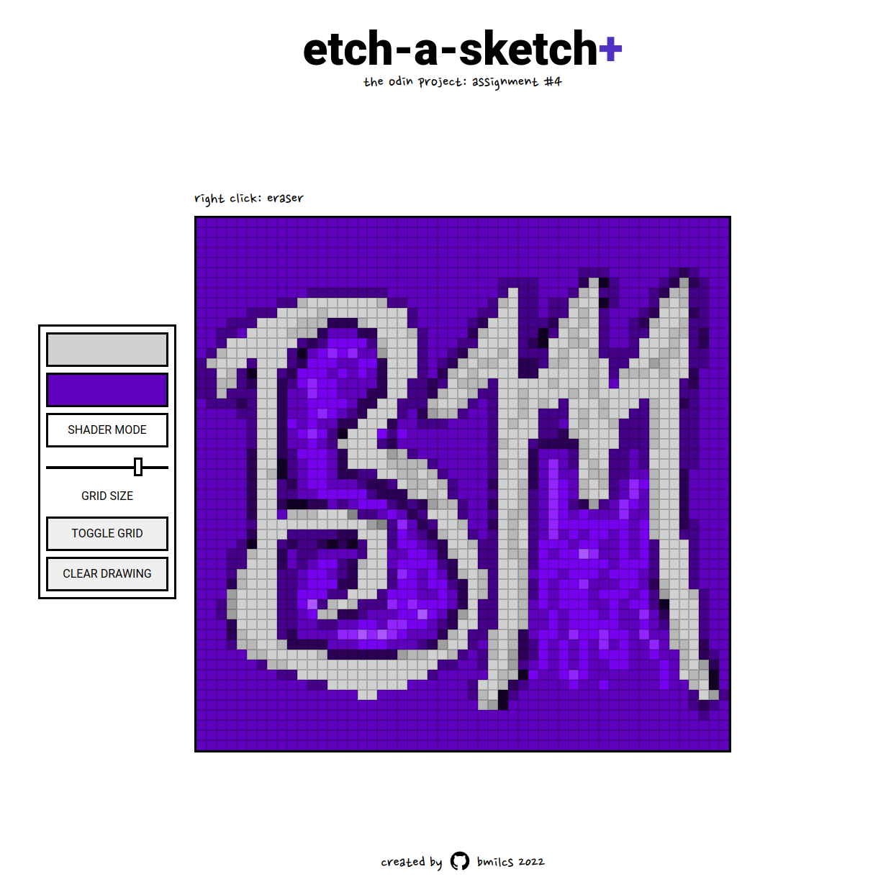

# Odin Project #4: Etch-A-Sketch

Welcome to Bryan Miller's Rock Etch-A-Sketch Project, the [fourth assignment](https://www.theodinproject.com/lessons/foundations-etch-a-sketch) within the Odin Project curriculum. The goal of this repo is to practice the following skill sets:

- HTML
- CSS
- JavaScript
- Chrome DevTools & Debugging
- Git Fundamentals

# Links

- [Live Demo](https://bmilcs.github.io/odin-etch-a-sketch/)
- [My Odin Project Progress](https://github.com/bmilcs/odin-project)

## Screenshots



## Deployment

```sh
git clone git@github.com:bmilcs/odin-etch-a-sketch.git
```
